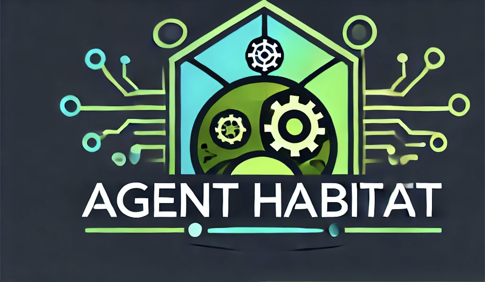
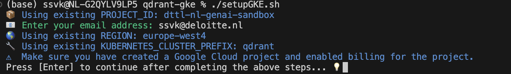

<div align="center" id="top">
  
  &#xa0;
</div>

<h1 align="center">Agent Habitat - Deploy GenAI Agents or Applications on GKE (With Weaviate)</h1>

<p align="center">
  
  
  
  
</p>

<p align="center">
  <a href="#about">About</a> &#xa0; | &#xa0;
  <a href="#technologies">Technologies</a> &#xa0; | &#xa0;
  <a href="#requirements">Requirements</a> &#xa0; | &#xa0;
  <a href="#starting">Starting</a> &#xa0; | &#xa0;
  <a href="#teardown">Teardown</a> &#xa0; | &#xa0;
  <a href="#license">License</a> &#xa0; | &#xa0;
  <a href="https://github.com/gatolgaj" target="_blank">Author</a>
</p>

<br>

**Important: This README is still WIP. If you encounter any issues in setup , please raise an issue**

## About

Agent Habitat is a platform to build and deploy Generative AI (GenAI) agents or applications on Google Kubernetes Engine (GKE). All applications are containerized using Docker and have access to a shared Qdrant cluster for vector similarity search.

## Technologies

The following tools were used in this project:

- [Python](https://www.python.org/)
- [Google Cloud SDK (gcloud)](https://cloud.google.com/sdk/docs/install)
- [Terraform](https://www.terraform.io/)
- [Helm](https://helm.sh/)
- [Weaviate](https://weaviate.io/)

## Requirements

Before starting, ensure you have the following:

- A Google Cloud project with billing enabled.
- Google Cloud SDK installed and configured.
- Terraform installed.
- Helm installed.
- Docker installed.
- Access to the cloned repository.

## Starting

### 1. Login to Google cloud from the Local Shell
```sh
gcloud auth login
```
This will open the browser and will ask to authorize.

### 2. Clone the repo and get the code.

Ensure you are in the root directory of the cloned repository:

```sh
git clone https://github.com/gatolgaj/agent-habitat.git 
```

### 3. Deploy the Agent Habitat Cluster

All the Steps required to setup the cluster is available in the script. Run the deployment script:

```sh
./setupGKE.sh
```
The the manifest files are written with `KUBERNETES_CLUSTER_PREFIX` as `habitat`. If you are using any other prefix , you will have to change the manifest files.
<div align="center" id="top">
  
  &#xa0;
</div>

Follow the prompts to enter the necessary details if they are not already set as environment variables.
Note : This is Still WIP. Its better run the commands in the batch file one by one. 

### 4. Deploy the Services or Agent to the cluster

With the cluster ready for production use, we can proceed to deploy our services to it. Follow the steps below to deploy a RAG (Retrieval-Augmented Generation) agent, which includes two services.

#### Step 1: Create a Google Container Registry Repository

Before pushing your Docker images, ensure that the Google Container Registry (GCR) repository is set up.

 1. Set up authentication for Docker to use Google Container Registry:

```sh
gcloud auth configure-docker $REGION.-docker.pkg.dev
```

 2. Create the GCR repository:

```sh
gcloud artifacts repositories create agent-habitat –repository-format=docker –location=<region>
```

2. Build and Push Docker Images

First, we need to build and push the Docker images for the services.

 1. Build and Push the Document Embedder Docker Image:
Navigate to the docker/embed-docs directory, build the Docker image, and push it to the Google Container Registry.

```sh
cd docker/embed-docs
docker build --platform linux/amd64 -t gcr.io/$PROJECT_ID/agent-habitat/embed-docs:1.0 .
docker push gcr.io/$PROJECT_ID/agent-habitat/embed-docs:1.0
```

 2. Build and Push the Chatbot Docker Image:
Navigate to the docker/chatbot directory, build the Docker image, and push it to the Google Container Registry.

```sh
cd docker/chatbot
docker build --platform linux/amd64 -t gcr.io/$PROJECT_ID/agent-habitat/chatbot:1.0 .
docker push gcr.io/$PROJECT_ID/agent-habitat/chatbot:1.0
```

3. Create a Service Account

Create a service account. Ensure that you update the file with the appropriate service account user(Find  ` iam.gke.io/gcp-service-account` in the `manifests/05-rag/service-account.yaml`file and update it to `<KUBERNETES_CLUSTER_PREFIX>-bucket-access@<PROJECT_ID>.iam.gserviceaccount.com`) and then run the command:

```sh
kubectl apply -n $KUBERNETES_CLUSTER_PREFIX -f manifests/05-rag/service-account.yaml
```

4. Deploy the Document Embedder Service

As a part of our RAG agent, deploy the document embedder service. This service listens for events when a file is uploaded to a bucket. Upon detecting an upload, the service processes the file and stores it in the Qdrant database.

```sh
kubectl apply -n <KUBERNETES_CLUSTER_PREFIX> -f manifests/05-rag/doc-embedder.yaml
```
5. Deploy the Cloud Storage and EventArc 

This will make sure that when a File is Uploaded to the Designated Bucket (`<PROJECT_ID>-<KUBERNETES_CLUSTER_PREFIX>-training-docs`), it triggers the embed-doc service.
```sh
kubectl apply -n <KUBERNETES_CLUSTER_PREFIX> -f manifests/05-rag/doc-embedder.yaml
```

6. Deploy the Chatbot Service

Next, deploy the chatbot service, which implements Retrieval-Augmented Generation (RAG). This service performs vector searches on the Qdrant database to answer users’ questions. It utilizes Google Vertex AI Gemini pro models for enhanced responses.

```sh
kubectl apply -n <KUBERNETES_CLUSTER_PREFIX> -f manifests/05-rag/chatbot.yaml
```
Once the services are deployed you can find the endpoint using 

```sh
kubectl get svc -n  <KUBERNETES_CLUSTER_PREFIX>
kubectl describe svc <SERVICE_NAME> -n <NAMESPACE>
```
You can Navigate to the link and chat with the App.


## Teardown

### 1. Teardown the Agent Habitat Cluster

Teardown script will make sure that you are not wasting resources or money .Run the teardown script:

```sh
./teardownGKE.sh
```

Follow the prompts to enter the necessary details if they are not already set as environment variables.

## Troubleshooting

- Ensure all necessary APIs are enabled in your Google Cloud project.
- Verify that billing is enabled for your Google Cloud project.
- Check that the necessary IAM roles are granted to your user account.
- If the scripts fail, ensure that all required tools (gcloud, terraform, helm) are installed and properly configured.

## License

This project is licensed under the MIT License. See the [LICENSE](LICENSE) file for details. All the Other Licences as per the file.

## Authors

Author: Shyam Sundar , based on the samples from google.

&#xa0;

<a href="#top">Back to top</a>
